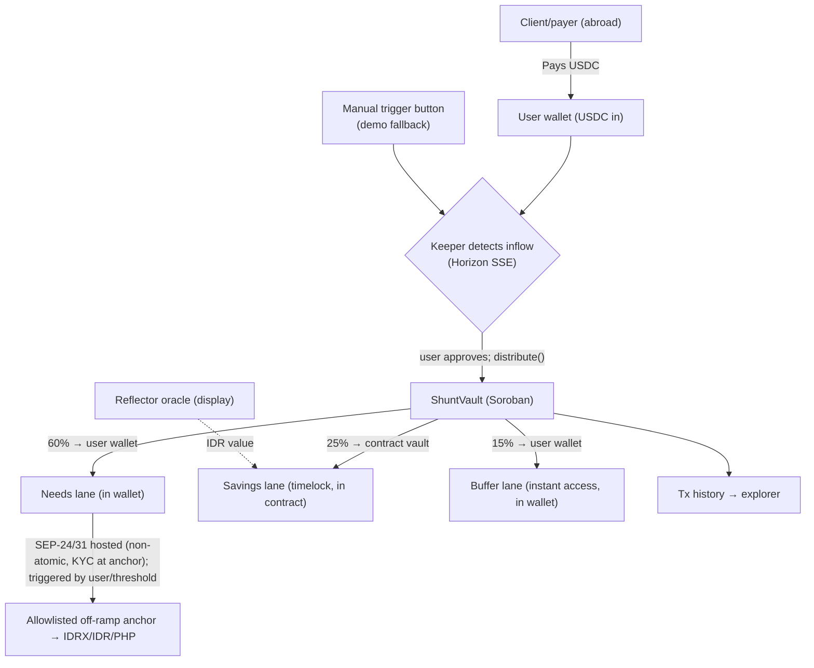

# Shunt — Product Requirements Document (PRD)

**Version:** 1.0 (Hackathon MVP — Web-first)
**Network:** Stellar (Soroban) · USDC via SAC (SEP-41)
**Context:** APAC Stellar Hackathon 2026

> **Shunt** — an electrical term: a component that diverts current to another path so the main circuit doesn't overload. Shunt does the same for your income: it diverts portions into separate lanes so no single lane overloads — and your savings don't erode against the rupiah.

---

## 1. Summary

Shunt is a "financial autopilot" for the money you receive from abroad. The moment USDC lands on Stellar, Shunt prepares the split according to rules you set once — you just confirm with one tap: part is kept in USDC (which holds its value and resists rupiah depreciation), part becomes a buffer (emergency fund), and part is cashed out to rupiah/PHP for everyday needs.
**Not** a remittance app. Shunt works *after* the money lands: it splits, saves, and protects the value.
**Platform:** Responsive Web App (mobile-first / PWA) → native mobile later
**Network:** Stellar (Soroban), USDC via SAC (SEP-41)

<aside>
📥
**On-ramp assumption (honest):** The MVP assumes income already lands as USDC on Stellar — this is the most fragile assumption, since most freelancers/migrants get paid via PayPal/Wise/bank. The on-ramp path (clients pay via a Shunt link that uses an anchor/CCTP behind the scenes to land USDC) is an explicit GTM part, not something we ignore.
</aside>

---

## 2. Problem

Shunt operates *after* USDC lands on Stellar, so the problem statement focuses on what we can actually solve:

1. **Leakage once it's in hand (main focus):** once it becomes a single balance, the money feels "spendable" and disappears; savings = leftover = zero.
2. **The rupiah keeps weakening:** ~Rp18,000/USD by mid-2026; saving in rupiah erodes every year.
3. **Irregular income:** there's no fixed salary to automate. The only clean moment to set money aside is when new income arrives.

<aside>
⚠️
Scope note: the conversion-fee leakage from PayPal/Wise (3–7%) happens *before* USDC reaches Stellar, outside Shunt's control. We only claim savings on the **off-ramp** side if the anchor path is cheaper — proven, not assumed.
</aside>

---

## 3. Why Stellar

- Flat sub-cent transaction fees → auto-splitting small amounts stays economical.
- Native USDC via SAC (SEP-41), **7-decimal** precision (important for split arithmetic & dust).
- ~second settlement; SEP-24/31 anchors for local fiat on/off-ramp.
- Circle CCTP live on Stellar (May 2026) → strong cross-chain USDC liquidity (relevant for inflow, not for local off-ramp).

---

## 4. Positioning per segment

A single one-liner isn't enough because two segments feel different pain:

| Segment                                          | Pain felt                                                      | Shunt's value                                                                 |
| ------------------------------------------------ | -------------------------------------------------------------- | ----------------------------------------------------------------------------- |
| Wedge: USDC holders (crypto-aware)               | Already out of rupiah; pain = discipline & money slipping away | Automated "pay yourself first" so it doesn't vanish, plus an emergency buffer |
| Mainstream: freelancers/migrants (income → IDR) | Rupiah erosion + savings = leftover                            | Value-holding savings (USDC) + targeted cash-out                              |

**Wedge one-liner:** "Set it once; every income is just one tap — split into its lanes, savings on autopilot."
**Mainstream one-liner:** "Set aside in a value-holding asset first, then cash out the rest to rupiah."

<aside>
🗣️
Honest positioning note: because the MVP needs **approval per inflow** (one tap), avoid claims like "no thinking / 100% autopilot." Safe framing: "set once, confirm once per income." Full autopilot claims only apply after hands-free session keys (roadmap).
</aside>

---

## 5. Goals & Non-goals

**Goals (MVP):**

- Prove the **split-on-income** engine end-to-end via the web app; the **split runs on testnet with real testnet USDC** as verifiable on-chain proof (hashes in SUBMISSION/README). A trivial mainnet split is a pre-launch step, not an MVP claim.
- Show the Savings lane entering the **contract vault** (timelock enforced) + **one sketched cash-out (off-ramp) step** to an anchor (SDF sandbox; real target IDRX/PHP corridor).
- Savings held in a value-holding asset + progress shown in IDR via an oracle.

**Non-goals (MVP):**

- Not yet fully hands-free (MVP needs approval per inflow; session keys = roadmap).
- Not yet native mobile (web/PWA first).
- Not a domestic payment tool (position: store-of-value + cross-border settlement).
- No yield/investment products yet.
- Gold lane deferred (thin SDEX liquidity) → P2.

---

## 6. Personas

- **Dina, 27** — freelance illustrator in Bandung, ~$2,000/mo from foreign clients. The MVP assumes she already receives USDC on Stellar (wedge profile); for the mainstream, the on-ramp is a separate, acknowledged challenge.
- **Rizal, 34** — migrant worker; targeted remittances to family + a savings set-aside.
- **Initial wedge:** USDC holders (browser wallet) → a good fit for web-first, testing the engine without depending on the on-ramp.

<aside>
⚖️
**Acknowledged paradox:** the wedge (crypto-aware, already disciplined enough to hold USDC) is exactly the segment that *least* needs a discipline tool; those who need it most (spend-prone mainstream) are hardest to onboard into self-custody. The wedge is used to **prove the engine**, not as the final market. The bridge to the mainstream (wallet/passkey abstraction, custodial-lite onboarding) is a post-validation step.
</aside>

---

## 7. Core concept: auto-split on arrival

The user sets rules once (e.g. Needs 60% / Savings 25% / Buffer 15%). Each USDC income arrives in the user's wallet, the keeper detects it and prepares the split; the user approves `distribute` (one tap). The split is guaranteed correct & atomic **within** a single contract call.
Each lane behaves differently (which determines where funds are stored):

- **Needs** → stays in the **user's wallet**; cashed out to fiat (off-ramp) when the user triggers it (or when a set threshold is reached). This cash-out is non-atomic (may involve KYC).
- **Buffer** → stays in the **user's wallet** (USDC), **instant access**, no timelock — emergency fund.
- **Savings** → moved **into the contract vault** (`deposit`), so the **timelock can actually be enforced**; only the user can withdraw (`withdraw_savings`), and early withdrawal incurs a penalty redirected to the buffer.

<aside>
🧩
Why Savings sits in the contract, not the wallet: if savings stayed in the user's wallet, the timelock would be fictional (the user could just transfer it out). To truly enforce discipline, the Savings lane MUST be held by code. This is not third-party custody — the contract only lets the owning user withdraw.
</aside>

---

## 7b. Business model & moat

**Principle: monetize services the user *wants* to perform, never the savings itself — and every revenue line is a service fee (ujrah), not interest.** Lending-based yield (Blend/Aave-style) is **explicitly excluded by design**: the yield is interest on loans (riba), which disqualifies Shunt for a large share of the Indonesian target market and creates smart-contract risk stacking. This resolves the tension noted in earlier drafts (monetizing the off-ramp while encouraging holding): the fee sits on the **Needs lane** — which is *designed* to be spent — and on **Invest conversions**, never on Savings deposits or post-lock withdrawals.

| Phase   | Revenue line                                                                   | Rate                  | Why it works                                                                                |
| ------- | ------------------------------------------------------------------------------ | --------------------- | ------------------------------------------------------------------------------------------- |
| 1 (MVP) | **Off-ramp fee** on Needs-lane cash-out (SEP-24)                         | 0.3–0.5%             | Users must cash out to live; fee shown before confirm; still far below PayPal's ~4%+FX path |
| 1 (MVP) | **On-ramp fee** on Top Up (SEP-24 deposit)                               | 0.3–0.4%             | Charged only when the user tops up voluntarily; transparent before confirm                  |
| 2       | **Invest-conversion fee** on the Invest lane (path-payment DCA)          | 0.3–0.5%             | Classic brokerage model; Shunt earns when users*build* assets, incentives aligned         |
| 3       | **Premium subscription** (multi-goal, session-key automation, analytics) | flat monthly          | Pure software fee; predictable revenue                                                      |
| 3       | **B2B "pay & split" API** for platforms/DAOs paying remote contractors   | per-tx, platform-side | Scales without 1-by-1 consumer acquisition                                                  |

Unit-economics sketch: a freelancer earning $1,000/mo who off-ramps ~60% and DCAs ~10% generates roughly **$45–60/yr** — 10k active users ≈ $500k/yr, enough for a lean team. Total user cost stays under the **1%-per-cycle** target.

**Sharia positioning (deliberate GTM asset, not a constraint):** all fees are ujrah; the 10% early-withdrawal penalty is returned to the *user's own* Buffer (no party profits from it); the Invest lane is spot purchase (bay'), not lending. Formal DSN-MUI certification is a post-funding roadmap item — until then the claim is "designed for sharia compliance," not "certified."

**Moat:** the combination of *auto-split at income-landing + code-custody savings (USDC) + integrated on/off-ramp + spot DCA* in one non-custodial app at sub-cent cost. Auto-split alone isn't new (Qapital, Digit); interest-free dollar savings + local-anchor rails is what neither local banks nor remittance apps can copy.

---

## 8. Custody model (two-tier)

<aside>
🔒
**The non-custodial definition we use:** no third party (including the keeper) holds the keys or can move user funds. It does *not* mean "all funds are always in the user's wallet" — some are held by **contract code** that only obeys its owner.
</aside>

**Technical reality:** a Soroban contract has ONE contract address, not one address per user. So we use a **two-tier** model:

- **Wallet tier (Needs + Buffer):** stays in the user's wallet, freely accessible. Purely non-custodial.
- **Vault tier (Savings):** USDC is moved into the `ShuntVault` contract via `deposit`. The timelock & penalty are enforced on-chain; withdrawal (`withdraw_savings`) **requires the owning user's auth** and a timelock check. The keeper can't withdraw anything.

**On "automatic" & auth (honest):** Soroban's `require_auth` needs a signature per invocation, and delegation (CAP-71) is still complex — "one-time pre-auth for any future inflow amount" isn't safely available yet. So the **MVP = the user approves each split (one tap)**; "automatic" means *automatic detection + tx preparation, one-touch confirmation*. **Session keys / smart accounts** (a delegated signer restricted to `distribute` under locked rules) are on the roadmap, not an MVP claim.

**Hands-free alternatives** (muxed/memo on a shared account, or a classic per-user account that gets swept) = **semi-custodial**; if used, we call it what it is and don't claim pure non-custodial.

---

## 9. Features (priority)

### P0 — required for the demo (deadline July 15 — keep it lean; one perfect flow > many half-built features)

- **F1** Onboarding & connect wallet (Freighter, browser extension).
- **F2** Detect income in the user's wallet + approve split per inflow (receive USDC; keeper holds no keys).
- **F3** Set Shunt rules (percentage sliders, min. 2 lanes) → `set_rules` tx.
- **F4** Split engine: keeper detects inflow → prepares `distribute`, **user approves (one tap)** → atomic split. **+ manual trigger button (demo fallback)**.
- **F5** Savings vault in the contract (`deposit` holds USDC + timelock; only the user can withdraw; shows USD value).
- **F6** Dashboard (total value, lane composition, recent activity).
- **F7** Transaction history (links to explorer).
- **F8 (slimmed)** One *sketched* off-ramp step: request to an anchor + pending status (SDF sandbox; real local-asset target = IDRX if available on Stellar, or the PHP corridor). Full anchor integration drops to P1.

### P1 — if time allows

- **F9** IDR value display (Reflector if an IDR feed exists; otherwise a forex/CEX rate in the frontend). **Shipped.**
- **F10** Full off-ramp anchor integration (SEP-24/31, including IDRX if on Stellar). **Shipped** (SEP-1/10/24 against SDF test anchor).

### P0.5 — integrated-ecosystem sprint (Jul 4–15, closes the "money can't get in" gap)

The MVP proved the split engine but assumed USDC is already in the wallet, and money could only *leave* via the anchor. This sprint makes Shunt the **single touchpoint** — in, split, invest, out — without the user ever opening another app. No Soroban contract changes: the vault stays frozen with its 11 passing tests.

- **F11 — On-ramp / Top Up (SEP-24 deposit).** Mirror of the existing withdraw flow: SEP-1 discovery + SEP-10 auth are already built; add `startDeposit` + a Top Up screen opening the anchor's hosted deposit (IDR in → USDC lands in wallet → keeper detects it like any inflow). *Target: Jul 4–6.* **Shipped Jul 4.**
- **F12 — Invest lane (auto-DCA).** A 4th slider in Configure Shunt. The invest share stays wallet-side (on-chain rules still receive needs+invest as the wallet-tier share, so the deployed contract is untouched) and is converted USDC→XLM via a **classic `pathPaymentStrictSend` to self**, prompted immediately after the split confirms. Honest scoping: a Soroban tx is single-operation by protocol, so split and conversion are **two sequential taps today**; merging into one invoke via an AMM router (Soroswap) is roadmap. Testnet USDC/XLM path liquidity must be validated day 1; if absent, the demo falls back to a **labeled** simulated rate (same pattern as the IDR forex fallback). *Target: Jul 6–9.* **Shipped Jul 4** (labeled fallback verified; testnet DEX liquidity still to validate with a funded USDC account).
- **F13 — Payment Request Link (SEP-7).** Generate a `web+stellar:pay` URI + shareable link/QR from inside Shunt ("request $500"); the payer opens it in any SEP-7-aware wallet. A card-checkout on-ramp partner (Transak/MoonPay-style) for non-crypto payers is displayed as an honest "coming soon" until a sandbox key is approved. This turns "users must already have USDC" from a prerequisite into an acquisition funnel. *Target: Jul 9–12.* **Shipped Jul 4** (SEP-7 link + QR + public payer page; card checkout = labeled "coming soon").
- **Docs, demo video, status flips.** *Target: Jul 12–15.*

### P2 — roadmap

- Full PWA / native mobile, integration with a **licensed IDR anchor/asset (e.g. IDRX)** + billers (PLN/e-wallets), an **allocated gold lane** (halal growth asset — see §7b), notifications, goal-based savings, **session-key auth** (hands-free split), card-checkout partner for F13 payer side, AMM-router merge of split+invest into one signature. (No BTC on the roadmap: there is no audited, liquid wrapped-BTC issuer on Stellar today — we don't put promises on the roadmap that depend on assets that don't exist.)

---

## 10. User flow

1. **Onboarding:** open the URL → see the value prop → connect Freighter.
2. **Setup:** adjust lane sliders → save (`set_rules`).
3. **Income arrives:** USDC lands in the user's wallet → keeper detects it.
4. **Auto-split:** keeper prepares, user approves (one tap) → `distribute()` splits atomically; Savings goes into the contract vault, Needs & Buffer to the wallet (fallback: manual button).
5. **See the result:** dashboard updates; savings shown in USD + IDR.
6. **Withdraw/spend:** the Needs lane is cashed out to fiat; savings are withdrawn (timelock checked).

---

## 11. Technical architecture (brief)

- **Frontend:** Vite + React + TypeScript (SPA, mobile-first, PWA-ready) + `@stellar/stellar-sdk` + Stellar Wallets Kit (Freighter etc.). Static deploy → Cloudflare Pages / Vercel.
- **Smart contract:** `ShuntVault` (Rust, soroban-sdk) — `set_rules` (rules + locked off-ramp destinations), `distribute` (split three lanes: Needs+Buffer to the user's wallet, Savings to the vault), `deposit` (Savings lane into the vault), `withdraw_savings` (user auth + timelock/penalty check). **Test rounding/dust** because USDC has 7 decimals.
- **Keeper/orchestrator:** Node/TS — streams Horizon `payments` (SSE) → detects inflow → submits `distribute`. **Idempotency based on tx hash/ledger**, retry, reconnect, + manual trigger fallback. Deployed always-on (Railway/Render/Fly.io), NOT timeout-prone serverless. *(As shipped this became a Cloudflare Worker with a 1-minute Cron poll of Horizon and state in Workers KV — see `keeper/README.md`; the app additionally detects un-split income client-side, and the keeper only ever prepares unsigned XDRs, never submits.)*
- **Oracle:** Reflector (ReflectorPulse, free) for value display — **first verify whether an IDR feed exists**; if not, pull the IDR rate from a forex/CEX API in the frontend (the oracle is display-only, not fund logic). Funds stay in the native asset.
- **On/off-ramp:** SEP-1/10/12/24/31 anchors — SDF sandbox for the demo. **Real local asset:** IDRX (a regulated rupiah stablecoin) — **verify whether a trustline/path exists on Stellar**; if so, that's a real off-ramp/local-asset lane that directly meets the judging criteria; if not, the PHP corridor (a real anchor) as the first GTM.
- **Network:** Testnet only for this submission (demo + on-chain proof). Mainnet is deferred until after validation + audit — not in scope now.

### Flow diagram: inflow → split → off-ramp

<aside>
🧭
Framing principle (for judges): the contract guarantees an atomic, correct split; "automatic" = an off-chain keeper that watches & triggers. This is not an over-claimed "blockchain does it automatically."
</aside>

---

## 12. Non-functional requirements

- **Security:** the keeper never holds keys/funds; `distribute` is user-approved. The Savings lane is held by code (only the owning user can `withdraw_savings`). **What can be locked on-chain is only the trusted anchor's Stellar address** allowed to receive the off-ramp USDC (an allowlist in the rules) — **not** the final destination bank account (the user chooses that in the anchor's hosted SEP-24 flow, off-chain). So the contract prevents funds from going to a foreign anchor; it doesn't lock a bank account number. Session keys (roadmap) are restricted to `distribute` under locked rules — not authority to withdraw.
- **Oracle integrity:** funds stay in the native asset, not synthetic.
- **Cost:** target < 1% total per cycle; network fees negligible.
- **Keeper reliability:** idempotency (no double-split), reconnect, manual fallback.
- **Responsiveness:** 360px (phone) → desktop; installable PWA.
- **Compliance:** Shunt is a **software layer** that never touches fiat; fiat licensing/custody & off-ramp are held by a **licensed anchor (e.g. IDRX/partner)**. Framing: store-of-value + cross-border settlement; avoid claiming to be a domestic payment tool or transfer service.

---

## 13. Success metrics

**For judges (demoable during the hackathon):**

- 1 smooth full flow in the web app; the **split happens on testnet with real testnet USDC** (verifiable on-chain proof), off-ramp shown as a request to an anchor.
- Inflow → **split** completed under 30 seconds (on-chain).
- Off-ramp: **settle** time reported separately (depends on the anchor, may involve KYC — not instant).
- Zero double-split (idempotency proven).

**For the product (post-hackathon):**

- **% of users whose savings balance grows after ≥ 2 inflows** (proof that discipline actually happens).
- **Average savings balance untouched for 30 days** (not just a trivial "% auto-split" that's 100% by design).
- Retention: users with ≥ 2 inflows.

---

## 14. Risks & mitigations

| Risk                                                                 | Mitigation                                                                                                                                                                |
| -------------------------------------------------------------------- | ------------------------------------------------------------------------------------------------------------------------------------------------------------------------- |
| Doesn't touch a local anchor/asset (judging criterion)               | At least 1 outbound off-ramp lane in the MVP; verify an IDR asset on Stellar; PHP corridor as GTM                                                                         |
| Keeper stalls during the demo                                        | Manual trigger button + tx-hash-based idempotency                                                                                                                         |
| Keeper = centralization point                                        | Honest framing; HA + idempotency; decentralization roadmap                                                                                                                |
| Oracle manipulation                                                  | Oracle is display-only; funds stay in the native asset                                                                                                                    |
| Regulation (OJK/BI)                                                  | Software-layer position; fiat licensing at the anchor (IDRX/partner); store-of-value + cross-border framing                                                               |
| USDC 7-decimal rounding/dust                                         | Test split arithmetic; round the remainder into one fixed lane                                                                                                            |
| Timelock unenforceable if funds are in the wallet                    | Savings lane held in the contract; only the user can withdraw                                                                                                             |
| Pre-auth/hands-free mechanism not safely available                   | MVP approves per inflow; session keys/smart accounts as roadmap                                                                                                           |
| IDRX/IDR asset not yet on Stellar                                    | Verify early; fall back to the PHP corridor (a real anchor) as GTM                                                                                                        |
| P0 scope too heavy for July 15                                       | Trim to the core split+dashboard; sketch the off-ramp; the rest is P1                                                                                                     |
| Wedge (USDC holders) needs a discipline tool the least               | Wedge proves the engine;**F13 payment links** turn acquisition into "get paid in USD" (no prior crypto needed on the payee side, on-ramp partner on the payer side) |
| Business model monetizes the action it suppresses                    | **Resolved (§7b):** fees sit on Needs off-ramp, Top Up, and Invest conversions — actions users want — never on Savings; subscription + B2B later                 |
| Lending yield alienates the sharia-sensitive majority market         | **Excluded by design** — all revenue is service fees (ujrah); spot DCA + gold lane are the growth story; DSN-MUI certification on roadmap                          |
| Soroban tx = single operation → split+invest can't be one signature | Honest two-tap UX today; AMM-router merge (Soroswap) on roadmap — never over-claim atomicity                                                                             |
| Testnet USDC/XLM path liquidity may be absent for F12 demo           | Validate day 1; labeled simulated-rate fallback (same pattern as IDR forex fallback)                                                                                      |
| On-ramp partner (card checkout) sandbox approval may lag F13         | Ship link generation + SEP-7 URI now; card checkout as labeled "coming soon" with mockup                                                                                  |
| Destination bank account can't be locked on-chain (SEP-24 hosted)    | Lock only the trusted anchor address (allowlist); final account via the anchor's KYC                                                                                      |
| Vault contract holds mainnet funds while unaudited                   | Keep the mainnet demo amount trivial + a disclaimer; audit before real mainnet                                                                                            |

---

## 15. Open questions

- Which anchor for the eventual production demo (SDF sandbox vs a real PHP/IDR partner)?
- When to transition web/PWA → native mobile (after validation)?
- Gold lane: which allocated token has enough mainnet liquidity?
- Which Soroban session-key/smart-account approach (e.g. CAP-71-based) is smoothest & safest to make the split truly hands-free post-MVP?
- Does IDRX (or another IDR asset) already have a trustline/off-ramp path on Stellar, or do we need to go through the PHP corridor first?
- Does Reflector have a reliable IDR feed, or do we need an off-chain rate?
- Off-ramp trigger for the Needs lane: manual, balance threshold, or schedule — which best fits user behavior?

---

# 🎤 Demo Day Pitch Script (5 minutes)

<aside>
⏱️
Target: 5 minutes. Structure = Hook (30s) → Problem (45s) → Solution & live demo (2m30s) → Why Stellar & differentiation (45s) → Traction/roadmap & closing (30s). Leave a buffer for demo transitions.
</aside>

### [0:00–0:30] Hook

> "Imagine you're an Indonesian freelancer. A client abroad pays you $2,000. The money lands, becomes a single balance — and within two weeks, it's gone. Savings? Leftover. That is: zero.
> It's called Shunt — an electrical term: a component that diverts current so the main circuit doesn't overload. Shunt does the same for your income."

### [0:30–1:15] Problem

> "There are two leaks. First, once it becomes a single balance, all the money feels 'spendable' — and it disappears. Second, even if you save it in rupiah, it erodes: the rupiah has already hit ~Rp18,000 per dollar.
> For irregular-income earners, there's no fixed salary to automate. The only clean moment to set money aside is when new income arrives. That's the moment Shunt captures."

### [1:15–3:45] Solution + live demo

> "Shunt isn't a money-transfer app. Shunt is a layer on top of money that has already landed — splitting it, saving it, protecting its value. The rules are set ONCE."

**Demo (share screen / URL):**

1. *Connect Freighter* → "Just a browser, no app install needed."
2. *Set rules with sliders* → "Needs 60, Savings 25, Buffer 15. Save — this is stored on-chain in the Shunt contract."
3. *USDC income arrives in the wallet* → "Income lands — Shunt detects it instantly."
4. *Auto-split happens* → "Shunt detects it, I approve once, and within seconds the money splits atomically into three lanes." (fallback: "if needed, trigger it manually — a safety net.")
5. *Savings* → "The savings lane is held in USDC — value-holding, not eroded by the rupiah. I also show the progress in rupiah via the Reflector oracle."
6. *One off-ramp lane* → "The Needs lane can exit to fiat through an anchor. And it's all transparent — every transaction has a link to the explorer."

### [3:45–4:30] Why Stellar & differentiation

> "Why Stellar? Sub-cent fees, so auto-splitting even small amounts stays economical. Native USDC. Per-second settlement. And an anchor network for local on/off-ramp.
> The difference from Wise or MoneyGram: they move the money and they're done. Shunt works AFTER the money lands — giving the structure and discipline that neither banks nor remittance provide."

### [4:30–5:00] Roadmap & closing

> "Today we've shown the engine running end-to-end — a real on-chain split executed with real testnet USDC, every step verifiable on the explorer. Next: the IDRX local asset, a gold lane, and native mobile.
> Income comes in once, automatically split into its lanes — and your savings aren't eroded by the rupiah. That's Shunt. Thank you."

### Anticipated judge questions (prepare answers)

- **"Truly non-custodial?"** → "Our definition: no third party holds the keys. Needs & Buffer live in the user's wallet; Savings is held by the contract CODE — only the owning user can withdraw, not the keeper. That lets the timelock be enforced without third-party custody."
- **"Isn't the keeper centralization?"** → "For the MVP, yes — we're honest about that. There's idempotency, reconnect, and a manual fallback. Decentralizing the keeper is on the roadmap."
- **"How is this different from just holding USDC?"** → "For those already holding USDC, the value is in automated discipline. For the mainstream, the value is in the bridge to rupiah + anti-erosion."
- **"Local anchor?"** → "Our real local-asset target is IDRX — a regulated rupiah stablecoin; we're checking its availability on Stellar. The demo uses the SDF sandbox; if IDRX isn't on Stellar yet, the first GTM goes through the PHP corridor with a real anchor."

---

# ⚡ Quick Pitch Script (3 minutes)

<aside>
⏱️
Condensed version for early rounds / limited slots. Structure = Hook (20s) → Problem (30s) → Core demo (1m20s) → Why Stellar & the difference (30s) → Closing (20s). Drop the details; keep only the flow the eye can see.
</aside>

### [0:00–0:20] Hook

> "An Indonesian freelancer gets paid $2,000 by a foreign client. The money lands, becomes a single balance — two weeks later it's gone, savings zero. Shunt fixes that: the moment income arrives, it's automatically split into its lanes."

### [0:20–0:50] Problem

> "Two leaks: money that becomes a single balance feels 'spendable' and then disappears; and if you save it in rupiah, it erodes — already ~Rp18,000 per dollar. The one clean moment to set money aside is when new income arrives."

### [0:50–2:10] Core demo (straight to screen)

> "The rules are set ONCE."

1. *Connect Freighter* → "just a browser."
2. *Sliders 60/25/15* → "save, stored on-chain."
3. *USDC income arrives in the wallet* → "Shunt detects it automatically."
4. *Auto-split* → "I approve once, and in seconds it splits into three lanes — atomically." (fallback: "trigger manually if needed.")
5. *Savings + cash-out* → "savings held in USDC, its rupiah value shown; the Needs lane can exit to fiat through an anchor. All transparent on the explorer."

### [2:10–2:40] Why Stellar & the difference

> "Sub-cent fees make splitting small amounts economical, native USDC, per-second settlement. Wise/MoneyGram just move money; Shunt works AFTER the money lands — giving structure and discipline."

### [2:40–3:00] Closing

> "The engine already runs end-to-end — we prove the split on-chain with real testnet USDC, every hash verifiable. Income comes in, one tap, instantly split into its lanes — and your savings aren't eroded by the rupiah. That's Shunt."
