<p align="center">
  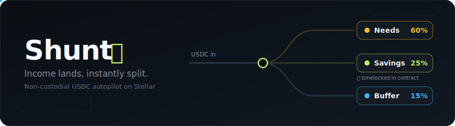
</p>

<p align="center">
  
  
  
  
  
</p>

<p align="center">
  <b>🌐 Live app: <a href="https://shunt-ruddy.vercel.app">shunt-ruddy.vercel.app</a></b> · testnet · connect Freighter and try the loop
</p>

**Get paid in dollars. Keep them worth something. Never watch a month's income evaporate again.**

Shunt is a financial autopilot for people who earn from abroad. The moment USDC lands in your Stellar wallet, one tap splits it by rules you set once: spending money stays liquid, an emergency buffer builds itself, savings get **locked by code** in hard value the rupiah can't erode, and a slice is **dollar-cost-averaged into assets** — automatically, at the one moment discipline is easy: payday.

> *Shunt* (electronics): a component that diverts current into parallel paths so no single path overloads. Shunt does the same for your income.

---

## Why people use it

Freelancers and overseas workers who invoice in dollars face three quiet leaks:

1. **The single-balance trap.** When $2,000 lands as one number, all of it *feels* spendable — and two weeks later it's gone. Savings become whatever's left over, which rounds to zero.
2. **Rupiah erosion.** Money parked in IDR loses value year after year (~Rp18,000/USD and weakening). Saving in your local currency is running up a down escalator.
3. **No salary, no automation.** Irregular income defeats every payroll-based savings tool. The only clean moment to set money aside is *the instant it arrives* — exactly the moment Shunt captures.

What you get is not "an app that splits money into pockets." It's four concrete outcomes:

| Outcome                                     | How                                                                                                                                         |
| ------------------------------------------- | ------------------------------------------------------------------------------------------------------------------------------------------- |
| 💵**Savings that hold value**         | Kept in USDC, not IDR — your safety net stops shrinking                                                                                    |
| 🔒**Savings you can't sabotage**      | Locked by a Soroban contract with a timelock, not by a label in an app. Early exit costs 10% — which goes to*your own* buffer, not to us |
| 📈**Investing that actually happens** | A slice of every income is spot-converted (DCA) the moment it lands — the strategy everyone knows and nobody sticks to                     |
| 🔁**One app for the whole loop**      | Money in, structured, and out to your bank — anchors and partners handle fiat; you never leave Shunt                                       |

## One app, the whole money loop

<p align="center">
  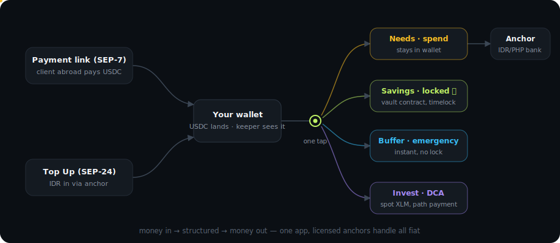
</p>

| Direction           | Feature                                                                                                                                                                                                | Status                        |
| ------------------- | ------------------------------------------------------------------------------------------------------------------------------------------------------------------------------------------------------ | ----------------------------- |
| **In**        | **Payment request links (SEP-7)** — send a link or QR, get paid in USDC from anywhere; no "do you have crypto?" conversation. Card checkout for non-crypto payers lands with an on-ramp partner | ✅ shipped (card checkout 🔜) |
| **In**        | **Top Up (SEP-24 deposit)** — IDR in through a licensed anchor's hosted flow, lands as USDC                                                                                                     | ✅ shipped (testnet anchor)   |
| **Structure** | **One-tap split** into Needs / Savings / Buffer / Invest, atomic on-chain                                                                                                                        | ✅ shipped                    |
| **Structure** | **Invest lane** — spot DCA to XLM via path payment after each split                                                                                                                             | ✅ shipped                    |
| **Structure** | **Code-custody savings** with timelock + penalty-to-your-buffer                                                                                                                                  | ✅ shipped                    |
| **Out**       | **Cash-out (SEP-24 withdraw)** — Needs lane to IDR/PHP bank via allowlisted anchors, rate & fee shown first                                                                                     | ✅ shipped                    |

Shunt never touches fiat and never holds your keys — licensed anchors do fiat, your wallet and the vault contract do custody. That's what makes the loop possible without Shunt becoming a bank or a remittance company.

## How it works

<p align="center">
  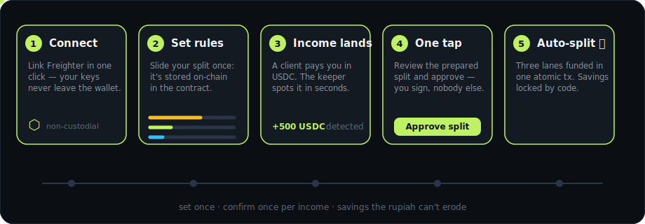
</p>

|   | Step                   | What happens under the hood                                                                                                                                                                                                                                           |
| - | ---------------------- | --------------------------------------------------------------------------------------------------------------------------------------------------------------------------------------------------------------------------------------------------------------------- |
| 1 | **Connect**      | Freighter browser wallet, one click. No app install, no sign-up, no custody.                                                                                                                                                                                          |
| 2 | **Set rules**    | Sliders for Needs / Savings / Buffer / Invest + a savings timelock. Saved on-chain via`set_rules` — the contract is the single source of truth.                                                                                                                    |
| 3 | **Income lands** | Via your payment link, a Top Up, or any direct USDC transfer. The keeper streams Horizon and detects it within seconds.                                                                                                                                               |
| 4 | **One tap**      | The keeper prepares an unsigned`distribute` transaction. You review the exact breakdown and sign. *Nothing moves without your signature.*                                                                                                                         |
| 5 | **Auto-split**   | One atomic Soroban transaction: Needs & Buffer stay in your wallet, Savings moves into the vault and the timelock starts. The Invest slice is then spot-converted to XLM by a follow-up path payment you approve in the same flow. Sub-cent fees, settled in seconds. |

**Where each lane lives — and why:**

| Lane                | Lives in           | Access             | Purpose                                                                                               |
| ------------------- | ------------------ | ------------------ | ----------------------------------------------------------------------------------------------------- |
| 🟡**Needs**   | Your wallet        | Anytime            | Daily spending; cash out to IDR/PHP via anchor when*you* choose                                     |
| 🟢**Savings** | The vault contract | After the timelock | Value-holding savings in USDC. Held by code — because a timelock in your own wallet would be fiction |
| 🔵**Buffer**  | Your wallet        | Instantly          | Emergency fund — no lock, no penalty, no questions                                                   |
| 🟣**Invest**  | Your wallet        | Anytime            | Spot DCA into XLM via Stellar path payment — an asset purchase, not a yield product                  |

Early savings withdrawals are possible but cost a **10% penalty — which isn't lost:** it's redirected into your Buffer credit inside the vault, withdrawable anytime. Discipline with a safety valve.

## Live on testnet

| Item                  | Value                                                                                                                                                                    |
| --------------------- | ------------------------------------------------------------------------------------------------------------------------------------------------------------------------ |
| Vault contract (USDC) | [`CA65BKKNEZEXOXK54G6BAVE3O4QMTCXGSA7YULHADELX5HOIOZPO7JUM`](https://stellar.expert/explorer/testnet/contract/CA65BKKNEZEXOXK54G6BAVE3O4QMTCXGSA7YULHADELX5HOIOZPO7JUM) |
| Proof vault (XLM)     | [`CADI23I2J2DMRB4YS63MGXJQCIN7QYYBCOIH6YSXJZFY63SPRNJDCMNL`](https://stellar.expert/explorer/testnet/contract/CADI23I2J2DMRB4YS63MGXJQCIN7QYYBCOIH6YSXJZFY63SPRNJDCMNL) |
| USDC SAC (testnet)    | `CBIELTK6YBZJU5UP2WWQEUCYKLPU6AUNZ2BQ4WWFEIE3USCIHMXQDAMA`                                                                                                             |

The main vault ran the **complete lifecycle on-chain with real testnet USDC** (acquired on the DEX via path payment — every hash below is clickable proof):

```text
change_trust USDC                                       ✓ trustline added
path_payment XLM → USDC (25 USDC via DEX)               ✓ real USDC, no faucet
set_rules  60/25/15, 1-day timelock                     ✓ stored on-chain
distribute 10 USDC                                      ✓ split exactly 6 / 2.5 / 1.5, `split` event emitted
distribute (replayed same inflow_key)                   ✗ rejected — Error #6, double-splits impossible
withdraw_savings 1.0 (still locked)                     ✓ paid 0.9 — 10% penalty → Buffer credit, not lost
get_savings / get_buffer_credit                         ✓ 1.5 / 0.1 — state readable by anyone
```

Proof transactions: [trustline](https://stellar.expert/explorer/testnet/tx/429694ebefb36b9f41b0033b174f3a503b6f975ddb22a9867b70a3720ead093f) · [USDC purchase](https://stellar.expert/explorer/testnet/tx/3bf334a7d55f83bf9e13ef665a912e5eccab02e71286dcebaedde15aaa3e7b33) · [set_rules](https://stellar.expert/explorer/testnet/tx/ccf020a0e95f8ba1aab12721863c14b9d5d41d233b77d67185d6703462d5cd9c) · [distribute](https://stellar.expert/explorer/testnet/tx/85cde3c33ac058dbe5b5c1e7b246147d75e239aae20adf00a70a8a2a6badfe06) · [withdraw + penalty](https://stellar.expert/explorer/testnet/tx/d60b135cc7e6fccf600ad6cd86aa97a692c9bfe41a111ee667469519ee72ef1e)

An earlier identical lifecycle ran on the XLM proof vault (`CADI…`) — same code path, 7-decimal arithmetic.

## The app

Mobile-first (~390px column, PWA-installable), scaling to a desktop nav rail at ≥1024px.

| | | |
|:---:|:---:|:---:|
| 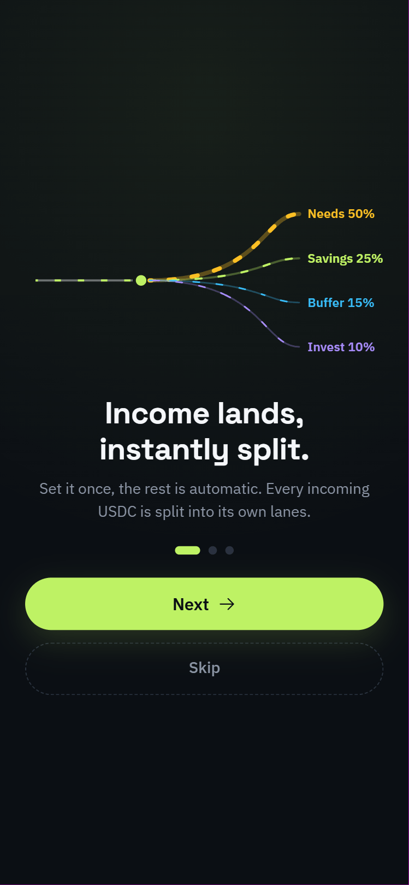<br>**Onboarding** | 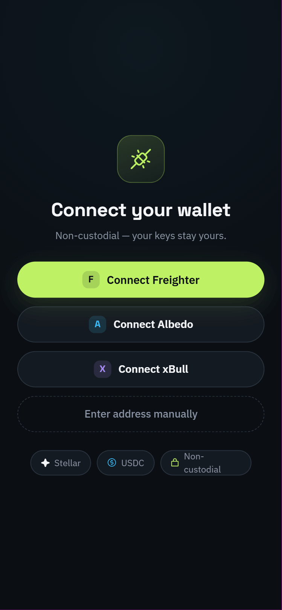<br>**Connect wallet** | <br>**Home** |
| 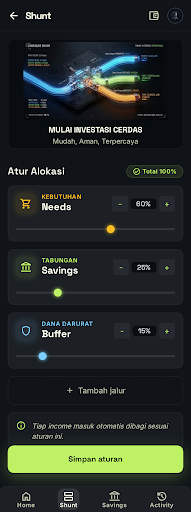<br>**Configure Shunt** | 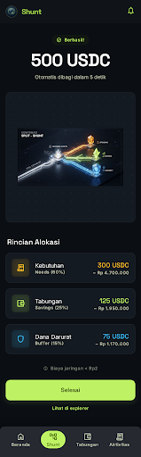<br>**Auto-split confirm** | 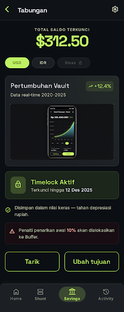<br>**Savings vault** |
| 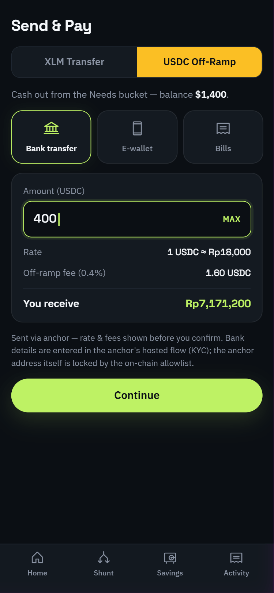<br>**Send & Pay** | <br>**Activity** | 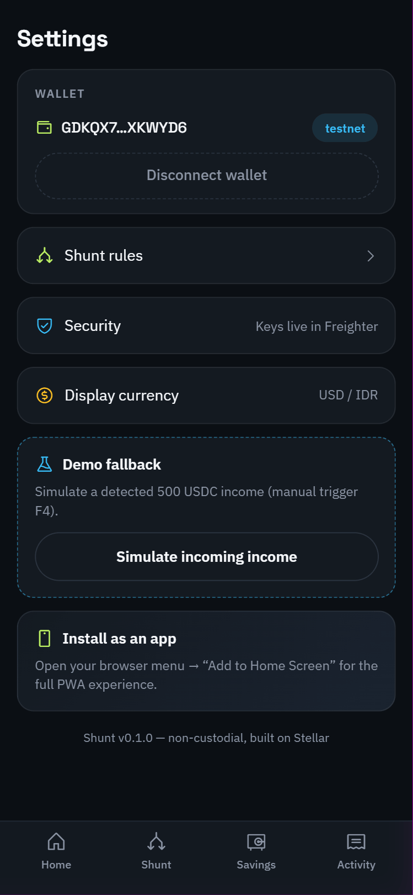<br>**Settings** |

### Level 1 — White Belt (testnet proof)

All four requirements are live in the app: wallet connect, XLM balance fetched from Horizon (visible on Home with a Friendbot fund button for empty accounts), native XLM transfer from the Send & Pay screen, and the resulting hash with a Stellar Expert explorer link. The on-chain lifecycle proof in [Live on testnet](#live-on-testnet) is independently verifiable on the explorer.

### Level 2 — Blue Belt (multi-wallet + events)

| Requirement | Screenshot |
|---|---|
| **Multi-Wallet Options**<br>Showing Freighter, Albedo, xBull | 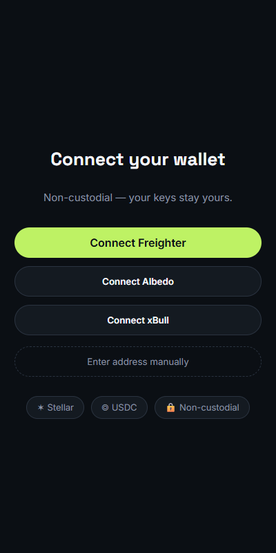 |
| **Real-time Event Toast**<br>Soroban split event detected | 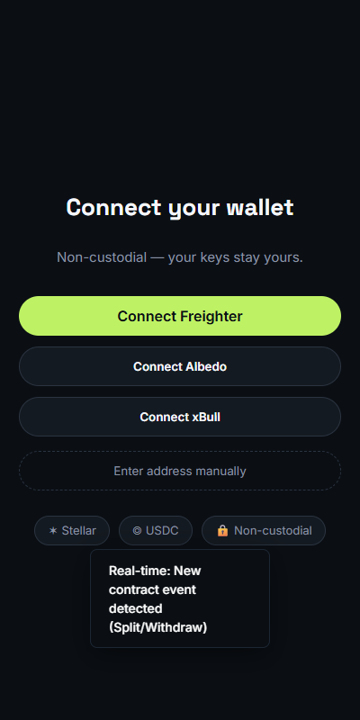 |

## Architecture

<p align="center">
  
</p>

Three deliberate design principles:

- **The keeper holds zero keys.** It only *watches* (Horizon payment stream, cursor-resumed reconnects) and *prepares* (unsigned XDR). Every fund movement requires your signature. If the keeper dies mid-demo, a manual trigger in Settings does the same job.
- **Savings must be held by code.** A timelock on funds in your own wallet is theater — you could just transfer them out. `ShuntVault` holds the Savings lane and enforces the lock on-chain; `withdraw_savings` answers to your address and no one else's. Not third-party custody — code custody, owner-only.
- **Double idempotency.** The keeper deduplicates by transaction hash *and* the contract rejects repeated `inflow_key`s. A retry, a reconnect, or a hostile replay all hit the same wall: one income, one split, ever.

### `ShuntVault` contract API

| Function                                                                    | Auth | Description                                                                                       |
| --------------------------------------------------------------------------- | ---- | ------------------------------------------------------------------------------------------------- |
| `init(token)`                                                             | —   | One-time: binds the USDC SAC address.                                                             |
| `set_rules(user, needs_bps, savings_bps, buffer_bps, lock_secs, anchors)` | user | Split rules in basis points (must total 10,000) + off-ramp anchor allowlist.                      |
| `distribute(user, amount, inflow_key)`                                    | user | Atomic 3-lane split. Dust from 7-decimal rounding lands in Needs. Replay-proof via`inflow_key`. |
| `deposit(user, amount)`                                                   | user | Voluntary top-up into the savings vault.                                                          |
| `withdraw_savings(user, amount)`                                          | user | Free after the timelock; 10% penalty → Buffer credit before it.                                  |
| `withdraw_buffer(user, amount)`                                           | user | Withdraw Buffer credit — never locked.                                                           |
| `offramp(user, anchor, amount)`                                           | user | Sends USDC only to**allowlisted** anchor addresses.                                         |
| `get_rules / get_savings / get_buffer_credit / get_lock`                  | —   | Read-only views.                                                                                  |

Errors are explicit (`NotInitialized`=1 … `AnchorNotAllowlisted`=9); penalty and denominators are named constants (`PENALTY_BPS = 1_000`, `BPS_DENOM = 10_000`), not magic numbers. Eleven unit tests cover the exact split, dust (no stroop lost, ever), replay rejection, rules validation, timelock behavior, and the allowlist. **The Invest lane deliberately does not touch this contract** — the invest share stays wallet-side and converts via a classic path payment, so the audited surface stays small and the deployed vault stays frozen.

## Money in, money out (the anchor stack)

Both directions run on the standard Stellar anchor rails, implemented in [`web/src/lib/anchor.ts`](web/src/lib/anchor.ts):

1. **SEP-1** — discover the anchor's endpoints from its `stellar.toml`.
2. **SEP-10** — prove wallet ownership by signing a challenge (no password, no account).
3. **SEP-24** — the anchor's hosted flow opens for KYC and bank details; Shunt polls the transaction status. `withdraw` = cash-out, `deposit` = Top Up — same stack, mirrored.

Plus **SEP-7** payment request links: a `web+stellar:pay` URI + QR any compatible wallet can open — the payee never explains crypto to a client again.

Rate and fee are always shown **before** confirmation. The default anchor is SDF's test anchor; the target corridor is a regulated IDR stablecoin (IDRX) or a PHP anchor — and the on-chain allowlist ensures USDC can only ever flow to an anchor *you* approved when setting rules. Settlement time is the anchor's (KYC involved) — Shunt reports it honestly instead of pretending it's instant.

## Business model — service fees, never interest

Every revenue line is a transparent fee on a service the user *wants*: 0.4% on Needs-lane cash-out, a similar fee on Top Up and on Invest conversions. **No lending, no yield products, no cut of your savings** — by design, not by omission: interest-based yield would add unnecessary smart-contract risk. The 10% early-withdrawal penalty goes to *your own* buffer, not to us. Savings deposits and post-lock withdrawals are free, forever.

## Quickstart

```bash
# 1. Contracts — test & build (Rust + stellar CLI)
cd contracts/shunt-vault
cargo test                      # 11 tests
stellar contract build

#    Deploy your own instance (or use the testnet one above)
stellar contract deploy --wasm target/wasm32v1-none/release/shunt_vault.wasm \
  --source <IDENTITY> --network testnet
stellar contract invoke --id <CONTRACT_ID> --source <IDENTITY> --network testnet \
  -- init --token CBIELTK6YBZJU5UP2WWQEUCYKLPU6AUNZ2BQ4WWFEIE3USCIHMXQDAMA

# 2. Keeper — inflow detection + tx preparation
cd keeper
cp .env.example .env            # VAULT_CONTRACT_ID + WATCH_ACCOUNTS
npm install && npm run dev      # http://localhost:8787

# 3. Web app
cd web
cp .env.example .env            # VITE_VAULT_CONTRACT_ID (+ anchor domain, keeper URL)
npm install && npm run dev      # http://localhost:5173
```

No contract configured? The app runs in **local demo mode** — the full flow (connect → rules → simulated income → one-tap split → vault → cash-out) works with local state, so you can feel the product before touching a faucet. The "Simulate incoming income" button lives in Settings.

## Repository layout

```
contracts/shunt-vault/   Soroban contract — split engine + savings vault (Rust)
web/                     React + TypeScript app, mobile-first, PWA-ready (Vite)
keeper/                  Node/TS watcher — Horizon stream, idempotent, manual fallback
design/                  Diagrams (animated SVG) + app screenshots
```

## Honest limitations

- **One tap per income, by design.** Soroban's `require_auth` wants a signature per invocation — and the Invest conversion is a second signature (a Soroban tx is single-operation by protocol). Never over-claimed as hands-free.
- **The keeper is centralized** in this version — but it holds zero keys, and a manual trigger makes it optional.
- **Anchor settlement is not instant** — KYC is involved, and the UI says so instead of hiding it.
- **The vault is unaudited.** Keep real amounts trivial until it is.

## Roadmap

|                 |                                                                                                                                                                                           |
| --------------- | ----------------------------------------------------------------------------------------------------------------------------------------------------------------------------------------- |
| **Next**  | Production IDR corridor (IDRX) · card checkout on payment links (on-ramp partner) · anchor status webhooks                                                                              |
| **Later** | Session keys — truly hands-free splits · split + invest in one signature (AMM router) · allocated-gold invest option · goal-based savings · native mobile · keeper decentralization |

---

<p align="center">
  <sub>⑃ money in · structured by code · money out — and the savings lane never lies to you</sub>
</p>
