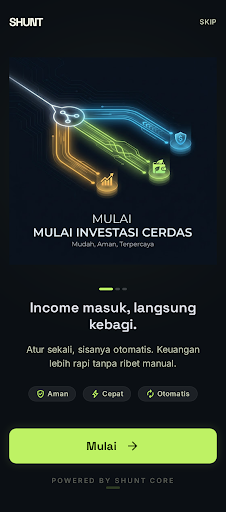
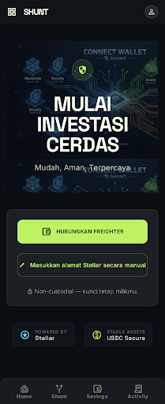
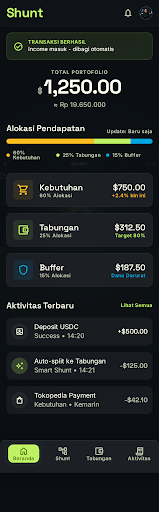
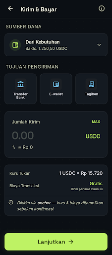
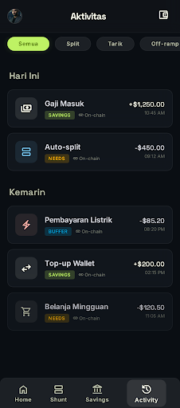
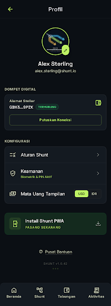

<p align="center">
  
</p>

<p align="center">
  
  
  
  
  
</p>

**Shunt is a financial autopilot for money you earn from abroad.** The moment USDC lands in your Stellar wallet, Shunt splits it into lanes you configured once — spending money stays liquid, an emergency buffer builds itself, and savings are locked in hard value that rupiah depreciation can't touch. One rule set, one tap per income. That's it.

> *Shunt* (electronics): a component that diverts current into parallel paths so no single path overloads. Shunt does the same for your income.

---

## Why this exists

Freelancers and overseas workers who invoice in dollars face three quiet leaks:

1. **The single-balance trap.** When $2,000 lands as one number, all of it *feels* spendable — and two weeks later it's gone. Savings become whatever's left over, which rounds to zero.
2. **Rupiah erosion.** Money parked in IDR loses value year after year (~Rp18,000/USD and weakening). Saving in your local currency is running up a down escalator.
3. **No salary, no automation.** Irregular income defeats every payroll-based savings tool. The only clean moment to set money aside is *the instant it arrives* — exactly the moment Shunt captures.

Shunt is **not** a remittance app. It's the layer *after* the money lands: it splits it, protects it, and gives it structure that neither banks nor transfer services provide.

## How it works

<p align="center">
  
</p>

| | Step | What happens under the hood |
|---|---|---|
| 1 | **Connect** | Freighter browser wallet, one click. No app install, no sign-up, no custody. |
| 2 | **Set rules** | Sliders for Needs / Savings / Buffer (e.g. 60/25/15) + a savings timelock. Saved on-chain via `set_rules` — the contract is the single source of truth. |
| 3 | **Income lands** | The keeper streams Horizon payments and detects your incoming USDC within seconds. |
| 4 | **One tap** | The keeper prepares an unsigned `distribute` transaction. You review the exact breakdown and sign. *Nothing moves without your signature.* |
| 5 | **Auto-split** | One atomic Soroban transaction: Needs & Buffer stay in your wallet, Savings moves into the vault and the timelock starts. Sub-cent fees, settled in seconds. |

**Where each lane lives — and why:**

| Lane | Lives in | Access | Purpose |
|---|---|---|---|
| 🟡 **Needs** | Your wallet | Anytime | Daily spending; cash out to IDR/PHP via anchor when *you* choose |
| 🟢 **Savings** | The vault contract | After the timelock | Value-holding savings in USDC. Held by code — because a timelock in your own wallet would be fiction |
| 🔵 **Buffer** | Your wallet | Instantly | Emergency fund — no lock, no penalty, no questions |

Early savings withdrawals are possible but cost a **10% penalty — which isn't lost:** it's redirected into your Buffer credit inside the vault, withdrawable anytime. Discipline with a safety valve.

## See it

Nine screens, mobile-first (~390px column, PWA-installable), scaling to a desktop nav rail at ≥1024px. Full-size mockups and interactive HTML in [`design/stitch/`](design/stitch/).

| | | |
|:---:|:---:|:---:|
| <br>**Onboarding** | <br>**Connect wallet** | <br>**Home** |
| <br>**Configure Shunt** | <br>**Auto-split confirm** | <br>**Savings vault** |
| <br>**Send & Pay** | <br>**Activity** | <br>**Settings** |

### White Belt Compliance (Screenshots)

As part of the Level 1 — White Belt requirements, here are screenshots of the working testnet application:

| Requirement | Screenshot |
|---|---|
| **1. Wallet Connected**<br>Showing Freighter connection | `` |
| **2. Balance Displayed**<br>Fetching XLM balance from Horizon | `` |
| **3. Successful Transaction**<br>Native XLM transfer | `` |
| **4. Transaction Result**<br>Hash & Explorer Link | `` |

### Blue Belt Compliance (Screenshots)

As part of the Level 2 — Blue Belt requirements, here are the screenshots of the multi-wallet functionality and event handling:

| Requirement | Screenshot |
|---|---|
| **Multi-Wallet Options**<br>Showing Freighter, Albedo, xBull | `` |
| **Real-time Event Toast**<br>Soroban split event detected | `` |

## Live on testnet

| Item | Value |
|---|---|
| Vault contract (USDC) | [`CA65BKKNEZEXOXK54G6BAVE3O4QMTCXGSA7YULHADELX5HOIOZPO7JUM`](https://stellar.expert/explorer/testnet/contract/CA65BKKNEZEXOXK54G6BAVE3O4QMTCXGSA7YULHADELX5HOIOZPO7JUM) |
| Proof vault (XLM) | [`CADI23I2J2DMRB4YS63MGXJQCIN7QYYBCOIH6YSXJZFY63SPRNJDCMNL`](https://stellar.expert/explorer/testnet/contract/CADI23I2J2DMRB4YS63MGXJQCIN7QYYBCOIH6YSXJZFY63SPRNJDCMNL) |
| USDC SAC (testnet) | `CBIELTK6YBZJU5UP2WWQEUCYKLPU6AUNZ2BQ4WWFEIE3USCIHMXQDAMA` |

The proof vault ran the **complete lifecycle on-chain** (XLM SAC, so funds were available without a USDC faucet — same 7-decimal code path):

```text
set_rules  60/25/15, 1-day timelock                     ✓ stored on-chain
distribute 10 XLM                                       ✓ split exactly 6 / 2.5 / 1.5, `split` event emitted
distribute (replayed same inflow_key)                   ✗ rejected — Error #6, double-splits impossible
withdraw_savings 2.5 (still locked)                     ✓ paid 2.25 — 10% penalty applied
get_buffer_credit                                       ✓ 0.25 — penalty credited to Buffer, not lost
withdraw_buffer 0.25                                    ✓ instant, no lock
```

## Architecture

<p align="center">
  
</p>

Three deliberate design principles:

- **The keeper holds zero keys.** It only *watches* (Horizon payment stream, cursor-resumed reconnects) and *prepares* (unsigned XDR). Every fund movement requires your Freighter signature. If the keeper dies mid-demo, a manual trigger in Settings does the same job.
- **Savings must be held by code.** A timelock on funds in your own wallet is theater — you could just transfer them out. `ShuntVault` holds the Savings lane and enforces the lock on-chain; `withdraw_savings` answers to your address and no one else's. Not third-party custody — code custody, owner-only.
- **Double idempotency.** The keeper deduplicates by transaction hash *and* the contract rejects repeated `inflow_key`s. A retry, a reconnect, or a hostile replay all hit the same wall: one income, one split, ever.

### `ShuntVault` contract API

| Function | Auth | Description |
|---|---|---|
| `init(token)` | — | One-time: binds the USDC SAC address. |
| `set_rules(user, needs_bps, savings_bps, buffer_bps, lock_secs, anchors)` | user | Split rules in basis points (must total 10,000) + off-ramp anchor allowlist. |
| `distribute(user, amount, inflow_key)` | user | Atomic 3-lane split. Dust from 7-decimal rounding lands in Needs. Replay-proof via `inflow_key`. |
| `deposit(user, amount)` | user | Voluntary top-up into the savings vault. |
| `withdraw_savings(user, amount)` | user | Free after the timelock; 10% penalty → Buffer credit before it. |
| `withdraw_buffer(user, amount)` | user | Withdraw Buffer credit — never locked. |
| `offramp(user, anchor, amount)` | user | Sends USDC only to **allowlisted** anchor addresses. |
| `get_rules / get_savings / get_buffer_credit / get_lock` | — | Read-only views. |

Errors are explicit (`NotInitialized`=1 … `AnchorNotAllowlisted`=9); penalty and denominators are named constants (`PENALTY_BPS = 1_000`, `BPS_DENOM = 10_000`), not magic numbers. Eleven unit tests cover the exact split, dust (no stroop lost, ever), replay rejection, rules validation, timelock behavior, and the allowlist.

## Cashing out (SEP-24)

The Needs lane exits to fiat through the standard Stellar anchor stack, implemented in [`web/src/lib/anchor.ts`](web/src/lib/anchor.ts):

1. **SEP-1** — discover the anchor's endpoints from its `stellar.toml`.
2. **SEP-10** — prove wallet ownership by signing a challenge with Freighter (no password, no account).
3. **SEP-24** — the anchor's hosted flow opens for KYC and bank details; Shunt polls the transaction status.

Rate and fee are always shown **before** confirmation. The default anchor is SDF's test anchor; the target corridor is a regulated IDR stablecoin (IDRX) or a PHP anchor — and the on-chain allowlist ensures USDC can only ever flow to an anchor *you* approved when setting rules. Settlement time is the anchor's (KYC involved) — Shunt reports it honestly instead of pretending it's instant.

## Quickstart

```bash
# 1. Contracts — test & build (Rust + stellar CLI)
cd contracts/shunt-vault
cargo test                      # 11 tests
stellar contract build

#    Deploy your own instance (or use the testnet one above)
stellar contract deploy --wasm target/wasm32v1-none/release/shunt_vault.wasm \
  --source <IDENTITY> --network testnet
stellar contract invoke --id <CONTRACT_ID> --source <IDENTITY> --network testnet \
  -- init --token CBIELTK6YBZJU5UP2WWQEUCYKLPU6AUNZ2BQ4WWFEIE3USCIHMXQDAMA

# 2. Keeper — inflow detection + tx preparation
cd keeper
cp .env.example .env            # VAULT_CONTRACT_ID + WATCH_ACCOUNTS
npm install && npm run dev      # http://localhost:8787

# 3. Web app
cd web
cp .env.example .env            # VITE_VAULT_CONTRACT_ID (+ anchor domain, keeper URL)
npm install && npm run dev      # http://localhost:5173
```

No contract configured? The app runs in **local demo mode** — the full flow (connect → rules → simulated income → one-tap split → vault → cash-out) works with local state, so you can feel the product before touching a faucet. The "Simulate incoming income" button lives in Settings.

## Repository layout

```
contracts/shunt-vault/   Soroban contract — split engine + savings vault (Rust)
web/                     React + TypeScript app, mobile-first, PWA-ready (Vite)
keeper/                  Node/TS watcher — Horizon stream, idempotent, manual fallback
design/                  Animated diagrams (SVG) + 9 Stitch mockups (HTML/PNG)
```

## Design system

Dark "live-wire" fintech: near-black navy `#0B0F14`, elevated surfaces `#141A21`, lime `#BEF264` for primary actions and the Savings lane, amber `#FBBF24` for Needs, electric blue `#38BDF8` for Buffer. Space Grotesk for headings and big numbers, Inter for body. The circuit-trace *split node* — one line branching into three — is the recurring motif from onboarding to the confirm dialog.

Decisions locked during implementation:

| Ambiguity | Decision |
|---|---|
| Desktop breakpoint | `<1024px` centered mobile column · `≥1024px` left nav rail |
| Allocation ≠ 100% | Save button disabled + inline over/short message — no silent auto-adjusting |
| Timelock penalty | `PENALTY_BPS = 1000` (10%) in the contract; credited to Buffer, withdrawable anytime |
| USD/IDR/Gold toggle | Display-only rates (funds stay USDC); IDR from a forex API with 10-min cache and labeled fallback; Gold visible but disabled until a viable allocated-gold feed exists |
| Text on lime/amber | Near-black `#0B0F14` (WCAG AA) |
| Lanes beyond three | Violet `#A78BFA`, then pink `#F472B6` — five max |

## Honest limitations

- **One tap per income, by design.** Soroban's `require_auth` wants a signature per invocation; safe unattended delegation (session keys / smart accounts) is on the roadmap, not over-claimed today.
- **The keeper is centralized** in this version. Mitigations shipped: idempotency, cursor-resumed reconnects, and a manual trigger that makes the keeper optional. Decentralizing it comes later.
- **Anchor settlement is not instant** — KYC is involved, and the UI says so instead of hiding it.
- **The vault is unaudited.** Keep real amounts trivial until it is.

## Roadmap

**Next** — production IDR corridor (IDRX trustline verification), full anchor status webhooks, IDR display via on-chain oracle where feeds exist.
**Later** — session-key auth for true hands-free splitting, native mobile, goal-based savings, an allocated-gold lane, notifications, keeper decentralization.

---

<p align="center">
  <sub>⑃ set once · confirm once per income · savings the rupiah can't erode</sub>
</p>
