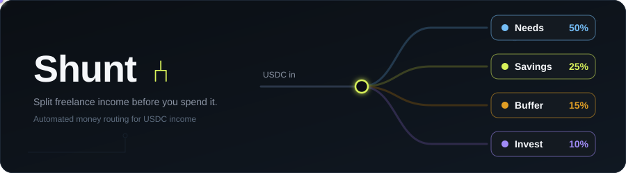

# Shunt

> **Ramp status, July 2026:** Shunt's Stellar split and vault flows run on testnet. The SDF SEP-24 flow is a labeled Stellar testnet simulation. Provider sandboxes are shown separately. A route is called live only after a licensed provider returns the exact country, fiat, asset, network, direction, order status, and matching Stellar mainnet settlement.

<p align="center">
  
</p>

<p align="center">
  
  
  
  
  
</p>

<p align="center">
  <b>🌐 Live app: <a href="https://shuntapp.xyz">shuntapp.xyz</a></b> &bull; testnet &bull; connect Freighter and try the loop<br>
  <i>(Includes 1-click testnet XLM/USDC funding directly on the Home screen)</i>
</p>

**Get paid in dollars. Keep them worth something. Never watch a month's income evaporate again.**

Shunt is a programmable income router for people who earn from abroad. The moment USDC lands in your Stellar wallet, **one tap** distributes it across dedicated reserves by rules you set once: everyday spending stays liquid, an emergency buffer fills, savings get **locked by code** in hard value that local inflation cannot erode, and—if you opt in—a slice is dollar-cost-averaged into a growth asset (XLM or gold). One tap per deposit, at the one moment financial discipline is effortless: payday.

> *Shunt* (electronics): a component that diverts current into parallel paths so no single line overloads. Shunt does the same for your cashflow.

### Built real, not slideware

* **49 Soroban unit tests** covering split exactness, rounding conservation, replay prevention, timelocks, penalties, laddered savings lots, unallocated withdrawal guards, per-user goal caps, authorization boundaries, and solvency invariants. Backed by a **real-testnet end-to-end suite** (Playwright) that funds a fresh account via Friendbot, purchases real testnet USDC on the DEX, and executes the full loop. Zero mocked network or contract interactions.
* **Non-custodial by construction**: The automated keeper holds **zero keys**. All protected savings reserves are held directly in contract code that only the wallet owner can authorize for withdrawal.
* **Recoverable keeper lifecycle**: Detected incoming transfers move through explicit `detected -> prepared -> confirmed` states. Preparing an unsigned XDR does not mark a task complete; completion occurs only after the keeper verifies a successful transaction on Horizon.
* **Two-layer replay protection**: The keeper suppresses confirmed inflows on indexer levels, while the smart contract independently rejects a repeated `inflow_key` across its on-chain state lifetime.
* **Verifiable on-chain**: Every routing step and savings lot transaction is backed by a clickable testnet hash ([Live on testnet](#live-on-testnet)).

---

## Why people use it

Freelancers and overseas contractors who invoice in foreign currency face three quiet cashflow leaks:

1. **The single-balance trap.** When $2,000 lands in an ordinary wallet as a single balance, all of it feels spendable. Within two weeks, it leaks into daily spending. Savings become whatever is left over, which reliably rounds to zero.
2. **Local currency erosion.** Capital held in depreciating fiat currencies loses purchasing power annually. Saving in an eroding currency is running up a descending escalator.
3. **No fixed salary, no existing automation.** Irregular income schedules defeat traditional payroll savings accounts. The only reliable moment to separate capital is *the exact second it lands*—precisely the window Shunt captures.

Shunt converts raw lump-sum payments into four concrete financial outcomes:

| Outcome | How It Works |
| :--- | :--- |
| **💵 Savings that maintain purchasing power** | Reserves stay in on-chain USDC rather than volatile local fiat, protecting hard-earned safety nets against devaluation. |
| **🔒 Savings you cannot impulsively sabotage** | Protected by Soroban contract timelocks and cooldown timers rather than a mere UI label. Early emergency withdrawal incurs a 10% penalty—**which redirects directly into your own accessible buffer**, never taken by the protocol. |
| **📈 Optional automated DCA investing** | An opt-in allocation spot-converts into XLM or gold on arrival. Completely decoupled from the primary safety net: set to 0%, and Shunt's core value-preservation rules execute identically. |
| **🔁 Integrated loop from arrival to payout** | Income routes on-chain, buffers build, and cash-out executes via supported regional Stellar anchors without leaving the interface. |

### How Shunt differs from standard vaults (Vaquita, Piggy Wallet, Microvault)

Standard smart vaults demand ongoing willpower. You receive money, open an app, navigate to a vault, and manually send a deposit transaction. For freelancers with irregular cashflow, this voluntary friction leads to procrastination.

Shunt removes willpower from the loop. It operates as an **income router**, not a static storage container. It intercepts cashflow at the initial entry point. When an invoice pays out or a client transfer settles, Shunt detects the inflow immediately. One single tap splits and distributes the complete arrival into spending pools, emergency cash, tax reserves, and timelocked positions simultaneously before funds leak into casual spending.

---

## 🏛️ Architecture & Waterfall Hierarchy

```
       [ Incoming Invoice / Payer Payment ($ Gross USDC) ]
                                │
                        ( Shunt Router )
                     [ Atomic Split Engine ]
                                │
       ┌───────────────┬───────┴───────┬───────────────┐
       ▼               ▼               ▼               ▼
 🚨 Emergency    📋 Obligation     🔒 Goal Lots     💳 Spendable
   Reserve          & Taxes         Timelocked        Wallet Pool
 (Priority #1)    (Tier 2 % Cut)    (Tier 3 Lots)   (Residual Liquid)
```

Shunt calculates fund distributions through a strictly ordered waterfall hierarchy that guarantees mathematical value conservation:

$$\text{Gross Inflow} \equiv \text{Emergency} + \text{Obligation} + \text{Goal Lots} + \text{Spendable}$$

1. **Emergency Reserve (Priority Tier 1)**: Fills first up to an explicit user-configured cap (e.g., $5,000 USDC), subject to a maximum refill percentage per inflow. Available immediately with zero timelocks or penalty deductions. Once capped, 100% of incoming allocations overflow directly to the next tier.
2. **Obligation & Tax Reserve (Tier 2)**: Automatically segregates capital for upcoming taxes or contracted debts. Protected by an on-chain cooldown request period (e.g., 3 days) to block impulsive spending of mandatory obligations.
3. **Timelocked Goal Lots (Tier 3)**: Each routed deposit generates an independent on-chain savings position locked until an explicit block maturity timestamp (e.g., 180 days). Early withdrawal incurs the internal buffer redirection penalty.
4. **Spendable Wallet Pool (Residual Liquid)**: Receives all remaining operational capital and rounding fractional remainders, sending funds immediately to your accessible spending address.

---

## 🔐 Cryptographic Split Protection & Revision Binding

Standard public checkout links remain vulnerable to mid-transit parameter manipulation, such as a merchant or recipient altering split proportions after issuing an invoice to bypass tax reserves. Shunt secures payment parameters through on-chain revision binding:

1. Every rule modification monotonically increments an on-chain revision counter (Revision #1 &rarr; Revision #2 &rarr; Revision #3).
2. Payment requests, QR invoices, and checkouts encode the exact revision number (`expected_policy_version`).
3. During execution, the smart contract verifies that the live policy revision matches the invoice payload. Any discrepancy reverts the settlement immediately, ensuring payer transparency and audit fidelity.

---

## 💻 TypeScript SDK Integration (`@shunt/sdk`)

Shunt provides a universal TypeScript client package for frontend checkouts, corporate dashboards, and automated verification workers.

```typescript
import { ShuntClient, calculateWaterfall } from "@shunt/sdk";

// 1. Calculate offline deterministic split breakdowns
const grossPayment = 5000; // 5,000 USDC
const breakdown = calculateWaterfall(
  grossPayment,
  1500, // Current Emergency Balance
  5000, // Emergency Cap Target
  3500, // 35% Max Refill Rate (bps)
  2000, // 20% Obligation Allocation (bps)
  2000  // 20% Timelocked Goal Allocation (bps)
);
console.log("Verified Spendable Liquid Pool:", breakdown.spendable);

// 2. Build on-chain routing transactions with revision binding
const client = new ShuntClient({
  networkPassphrase: "Test SDF Network ; September 2015",
  rpcUrl: "https://soroban-testnet.stellar.org",
  contractId: "C_SHUNT_ROUTER_CONTRACT_ID",
});

const tx = await client.buildRoutePaymentTx(
  "GA_PAYER_WALLET_ADDRESS",
  "GB_RECIPIENT_ADDRESS",
  5000,
  "INV-2026-Q3-891",
  2 // Expected Policy Revision Number
);
```

---

## ⚡ Durable Event Indexer (Keeper Service)

To power real-time audit receipts without saturating public Soroban RPC nodes, Shunt ships an edge-deployed event indexer operating on Cloudflare Workers and KV storage.
* **Persistent Cursors**: Automatically stores the latest verified ledger sequence to Cloudflare KV (`indexer:durable_cursor`).
* **Resilient Recovery**: Resumes index synchronization precisely from the checkpoint following network congestion or maintenance.
* **Public Endpoints**: Query `/indexer/events/:account` to retrieve verified routing records and conservation invariants in milliseconds.

---

## Live on testnet

| Item | Value |
| :--- | :--- |
| **Vault Contract (USDC)** | [`CDMFJZ6VRD2JEV7J2W7KMZZ3AXNSOST2C6L2KYRJAYIN7ULWJEOCWO5B`](https://stellar.expert/explorer/testnet/contract/CDMFJZ6VRD2JEV7J2W7KMZZ3AXNSOST2C6L2KYRJAYIN7ULWJEOCWO5B) — Current security-hardened deployment (superseding `CC7E…` and `CB27…`). |
| **Demo Assets Issuer** | [`GD3Y3DQEC6XIZME2PKSBKJ263E2UREV2WVSDJRKC3MJKBDU2RRM3IHZF`](https://stellar.expert/explorer/testnet/account/GD3Y3DQEC6XIZME2PKSBKJ263E2UREV2WVSDJRKC3MJKBDU2RRM3IHZF) — Shunt testnet issuance with seeded DEX liquidity pools. |
| **USDC SAC (Testnet)** | `CBIELTK6YBZJU5UP2WWQEUCYKLPU6AUNZ2BQ4WWFEIE3USCIHMXQDAMA` |
| **Keeper Worker** | [`shunt-keeper.irhamtria.workers.dev`](https://shunt-keeper.irhamtria.workers.dev/health) |

The contract ran its complete financial lifecycle on-chain using real testnet USDC acquired via DEX path payment. Click any transaction hash below for ledger verification:

* [Contract Deploy](https://stellar.expert/explorer/testnet/tx/4f31657d92242ad75502cc4881613693a003aa4fe68866af2b23e0c239850f09) &bull; [Initialize against USDC SAC](https://stellar.expert/explorer/testnet/tx/50e46cb3c001b9de470f80963461c5649d576a6383733e89873a758a261f533d)
* Historical execution records on prior `CC7E…` instance: [set_rules](https://stellar.expert/explorer/testnet/tx/2ef8083f38e14c379812b593f795253322c22f84f55e9062fbb483ad04f11068) &bull; [distribute split](https://stellar.expert/explorer/testnet/tx/ce3ce8010df371369f0350b42b3a3fb973fd66d2feac747b208933b2beae5a11) &bull; [create_savings_goal](https://stellar.expert/explorer/testnet/tx/698b60e1f87ab16dbe817e4efc7f046fc86427aefc9940dc82ee5cd64116209f) &bull; [withdraw_from_goal](https://stellar.expert/explorer/testnet/tx/910b71a337e7d9843f65e3923e6870ec11efb67fa05e21f3359f103f0c2ef898)

---

## How a real regional user onboards (honest go-to-market)

Shunt's split engine assumes USDC resides on Stellar. Bridging local workers to that point requires clear staging without over-claiming finished infrastructure:

| User Target | Onboarding Pathway | Status |
| :--- | :--- | :--- |
| **Wedge: Crypto-aware freelancer / DAO worker** | Already receiving international USDC; connects Freighter directly. | ✅ Operational today |
| **Contractor billing a foreign enterprise** | Issues a Shunt **SEP-7 Payment Link / Accountless Checkout**; client pays via standard crypto wallets or integrated card on-ramps. | ✅ Shipped for crypto checkouts &bull; 🔜 Card ramps in pipeline |
| **Mainstream worker** | **SEP-24 Top Up** via hosted anchor deposit flows, converting fiat directly into routed on-chain USDC. | ⚙️ Tested against SDF simulation &bull; Requires regional anchor licensing |

**Rupiah is the story; the Philippines is the live beachhead.** Our primary target market is Indonesia, addressing the currency devaluation problem that inspired the protocol. However, the fiat corridor live on Stellar today is **PHP via MoneyGram**, not IDR. There is currently no production IDR off-ramp on Stellar; IDRX is a target regulated stablecoin awaiting ecosystem availability. We demonstrate operational engine reliability in live APAC corridors now without inventing unreleased cash-out integrations.

---

## Business model — service fees, never interest

Every revenue line represents a transparent fee on an automated utility: 0.4% on immediate spending payouts and comparable service fees on Top Up and Invest conversions. 

**Zero lending, zero yield products, and zero rehypothecation.** This is an explicit design choice: interest-bearing yield strategies introduce unacceptable counterparty and smart-contract protocol risks to an individual's emergency safety net. Savings deposits and post-maturity lot withdrawals remain completely free of service charges, forever. Shunt's operational take is a blended **~0.29% of processed routing volume**.

---

## Quickstart & Verification

```bash
# 1. Smart Contracts — Verify 100% test suite pass rate
cd contracts/shunt-vault
cargo test
stellar contract build

# 2. Durable Keeper Worker — Cloudflare Worker Event Indexer
cd ../../keeper
npm install
npm test
npx wrangler dev --local        # Runs edge listener on http://localhost:8787

# 3. Web Application — Run interactive UI & Payer Checkout locally
cd ../web
cp .env.example .env
npm install
npm test -- --run               # Verifies 23 front-end invariant unit tests
npm run build                   # Generates type-checked production bundle
npm run dev                     # Open http://localhost:5173
```

When started without a deployed contract connection, the web dashboard operates in **local interactive demo mode**. You can test automated income simulations, configure waterfall allocation rules, explore Payer Checkouts, and verify conservation proofs offline.

---

## Honest limitations & Roadmap

* **One signature per routing execution.** Soroban's `require_auth` requires explicit cryptographic consent per transaction invocation. Shunt is never advertised as completely hands-free or automated without owner verification.
* **Anchor settlement timing depends on real-world compliance.** SEP-24 cash-out integrations rely on regional partner KYC and compliance checks; the UI clearly displays waiting intervals instead of promising instantaneous bank receipt.
* **Contract upgradeability.** The currently deployed testnet instances operate without administrative upgrade proxies to preserve immutable on-chain proof hashes. Production mainnet deployments will incorporate governed administrative controls and formal security audits prior to large capital acceptance.

### Roadmap Priorities
* **Next**: Complete partner allowlists for Regional Ramps &bull; Implement direct debit/credit checkouts on public SEP-7 invoices &bull; Add real-time webhooks for bank off-ramp tracking.
* **Later**: Account Abstraction and Session Keys for trusted hands-free split routing &bull; Automated single-block DEX swaps for gold and growth targets &bull; Native mobile applications &bull; Decentralized keeper network sequencing.

---

<p align="center">
  <sub>⑃ money in &bull; structured by code &bull; money out — and the savings reserve never lies to you</sub>
</p>
